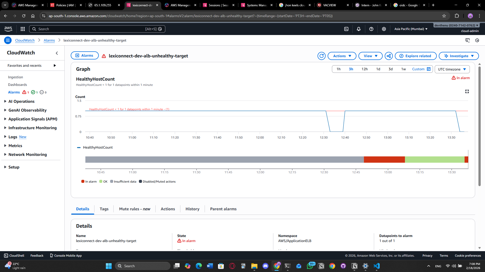
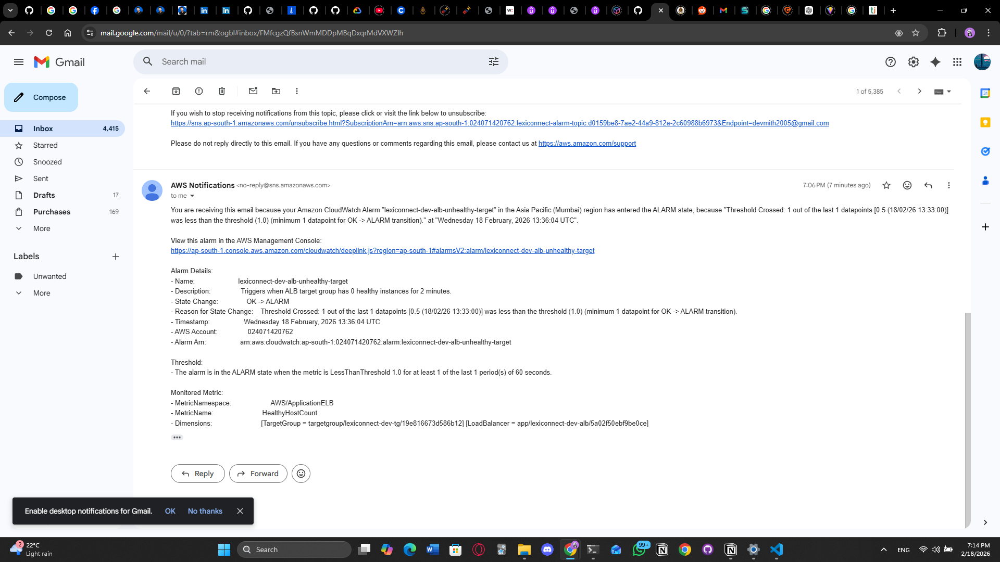
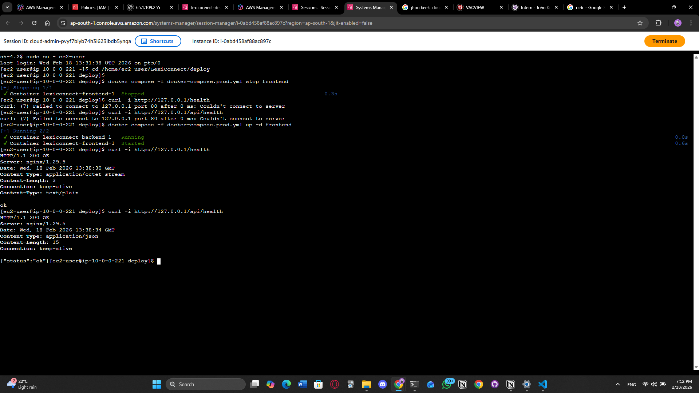
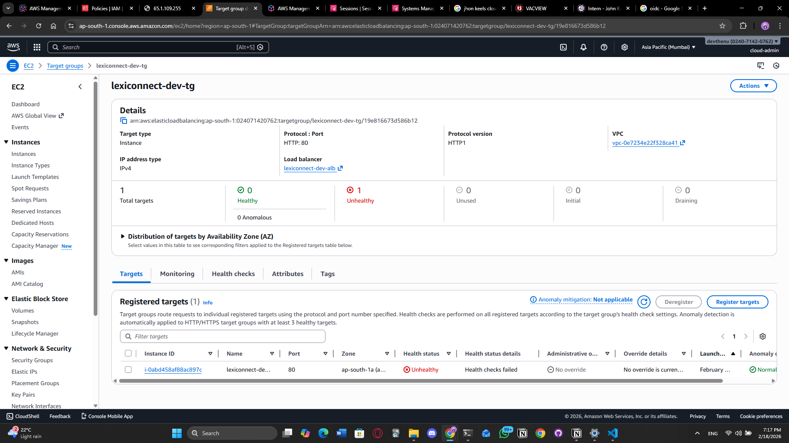
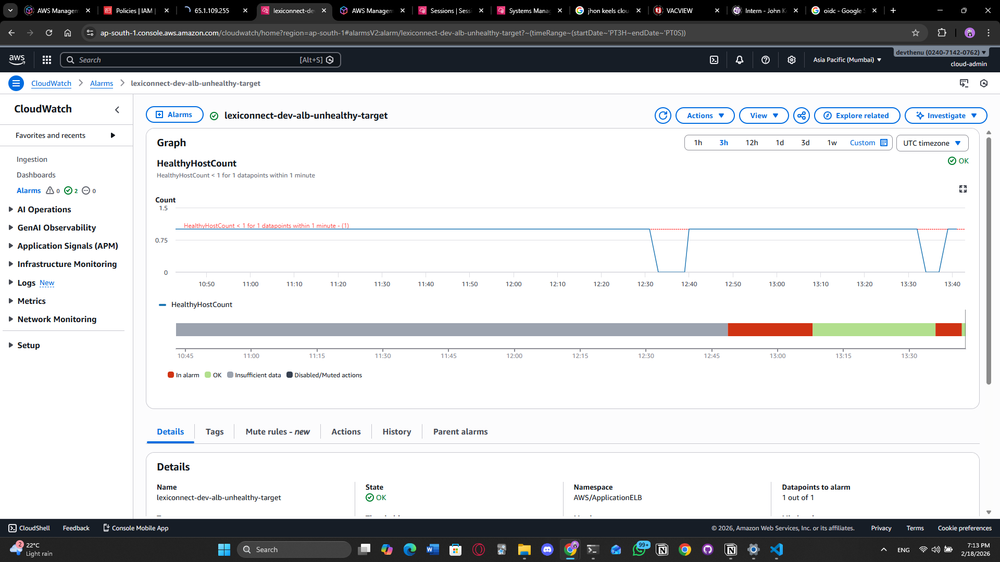
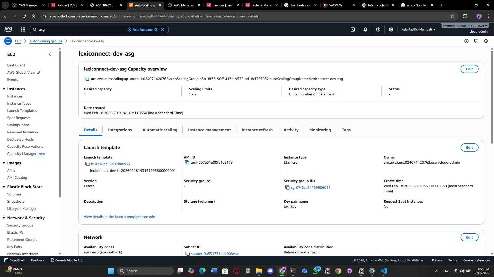

# Incident RCA: ALB Target Unhealthy (LexiConnect Dev)

**Date:** 2026-02-18  
**Environment:** dev  
**Service:** LexiConnect (frontend + backend)  
**Severity:** SEV-2 (Service partially unavailable)  
**Status:** Resolved

## Summary

The LexiConnect dev environment experienced downtime where the Application Load Balancer (ALB) reported the target as unhealthy and users received `502 Bad Gateway` errors. The reverse proxy path returned `502` because the backend upstream became unavailable, resulting in failed ALB health checks. CloudWatch alarm for `HealthyHostCount < 1` triggered and SNS notification was received.

## Impact

- ALB returned `502 Bad Gateway` for `/api/health`
- Backend API became unreachable
- Frontend could not load API-dependent features
- Duration of outage: ~10 minutes
- Only dev environment affected

## Detection

The incident was detected through:

1. CloudWatch Alarm `lexiconnect-dev-alb-unhealthy-target`
2. Alarm transitioned from OK -> ALARM
3. SNS email notification received
4. Manual verification showed `502 Bad Gateway` on backend health endpoint




## Timeline (UTC)

| Time (UTC) | Event |
|-----------|------|
| 13:30 | Backend container became unavailable (stopped/unreachable) |
| 13:30 | `curl http://127.0.0.1/api/health` returned `502 Bad Gateway` |
| 13:32 | ALB Target Group health check failed |
| 13:33 | CloudWatch alarm moved to `INSUFFICIENT_DATA` |
| 13:35 | Alarm moved to `ALARM` |
| 13:36 | SNS email notification received |
| 13:40 | Backend service recovered using docker compose |
| 13:42 | ALB target became healthy |
| 13:43 | Alarm returned to `OK` |





## Root Cause

The reverse proxy (frontend nginx) returned `502` because the backend upstream was unavailable (backend container stopped/unreachable), causing ALB health checks to fail and targets to be marked unhealthy.

## Contributing Factors

- Backend container failure was not automatically recovered
- At incident time, deployment used a single EC2 instance without self-healing
- No container restart policy was configured initially
- CloudWatch alarm was configured with missing-data behavior that temporarily showed `INSUFFICIENT_DATA`

## Resolution

The backend container was restarted using:

```bash
docker compose -f docker-compose.prod.yml up -d backend
```

After restart, ALB health checks succeeded and the target group returned to healthy status. CloudWatch alarm transitioned back to OK.

## Corrective Actions Taken

- Implemented CloudWatch Alarm on HealthyHostCount
- Connected SNS email notifications for alerts
- Verified alarm transitions through simulated backend outage
- Confirmed deterministic deployments using SHA pinned tags
- Implemented Auto Scaling Group (ASG) migration for self-healing



## Preventative Improvements (Planned)

- Add docker restart policy (`restart: always`) for backend and frontend
- Add CloudWatch log shipping for backend logs
- Add ALB 5XX alarm to detect proxy failures early

## Lessons Learned

- CloudWatch alarms require real metric datapoints; otherwise they remain in INSUFFICIENT_DATA
- Backend container availability is critical for ALB health checks
- Alerting is only useful when combined with automated recovery
- SHA-based deployments provide safer rollback and version traceability

## Screenshot Checklist

| Filename | What to Screenshot |
|---|---|
| `cloudwatch_alarm_in_alarm.png` | Alarm showing red "In alarm" |
| `cloudwatch_alarm_history.png` | Alarm History tab showing transitions |
| `sns_email_notification.png` | The email from SNS |
| `ssm_terminal_502.png` | SSM terminal showing curl 502 |
| `alb_target_unhealthy.png` | Target group showing unhealthy |
| `github_actions_deploy_success.png` | Deploy workflow run success |
| `github_actions_build_sha.png` | Build workflow showing commit SHA |
| `asg_instance_inservice.png` | ASG instances tab showing target instance in `InService` |


