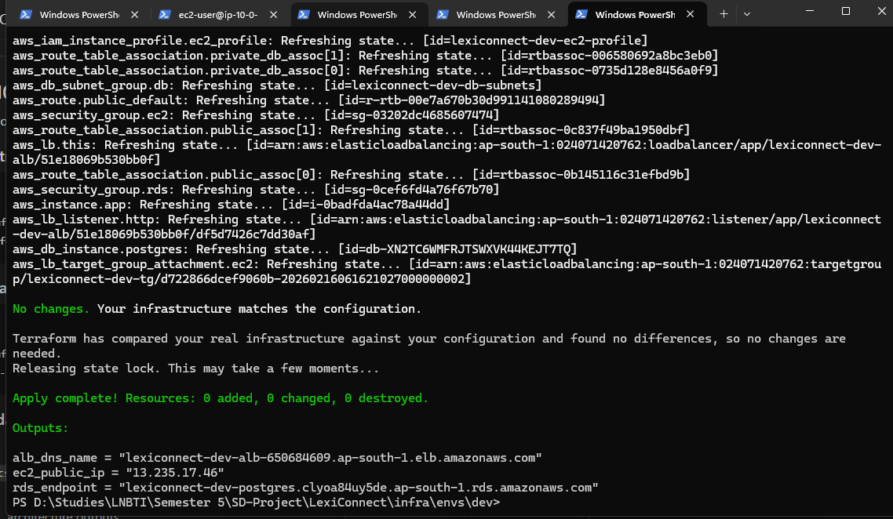
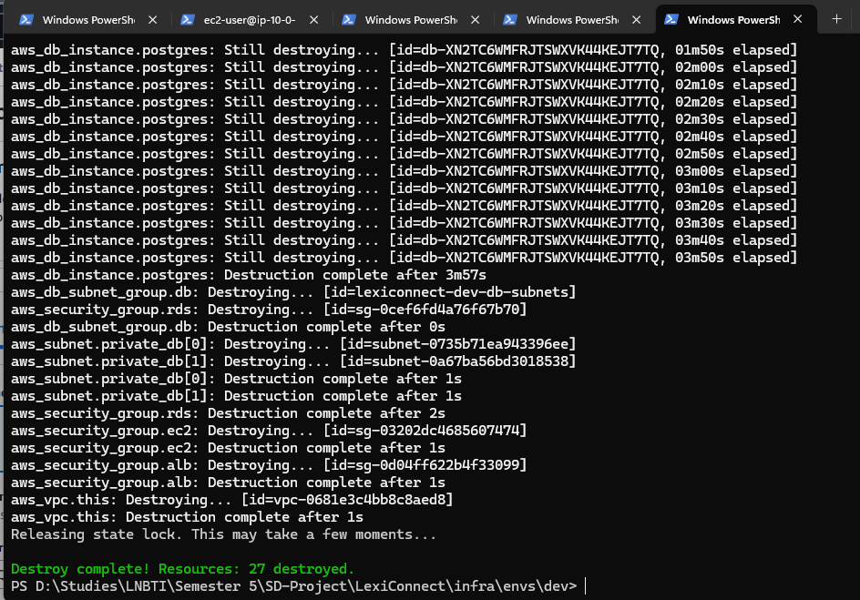
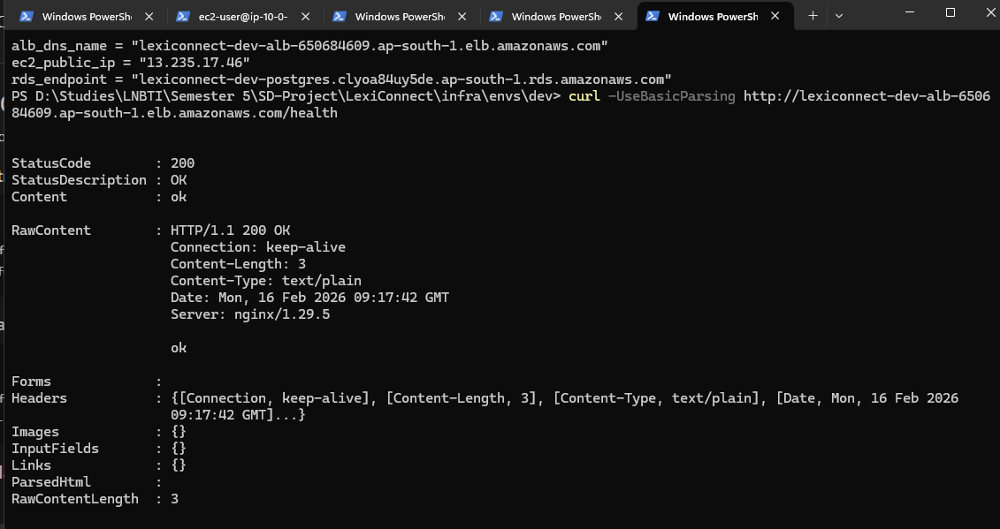
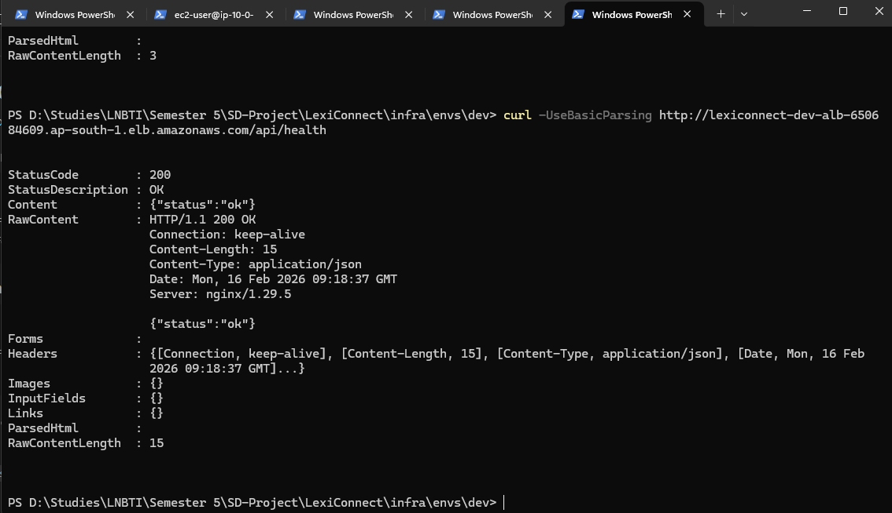
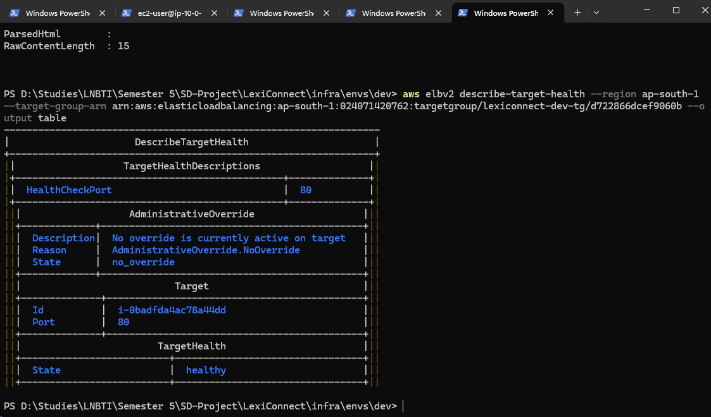
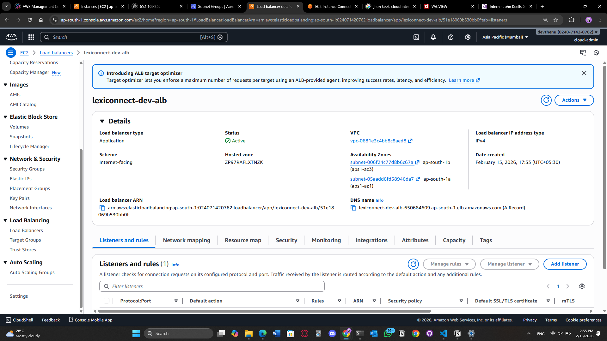
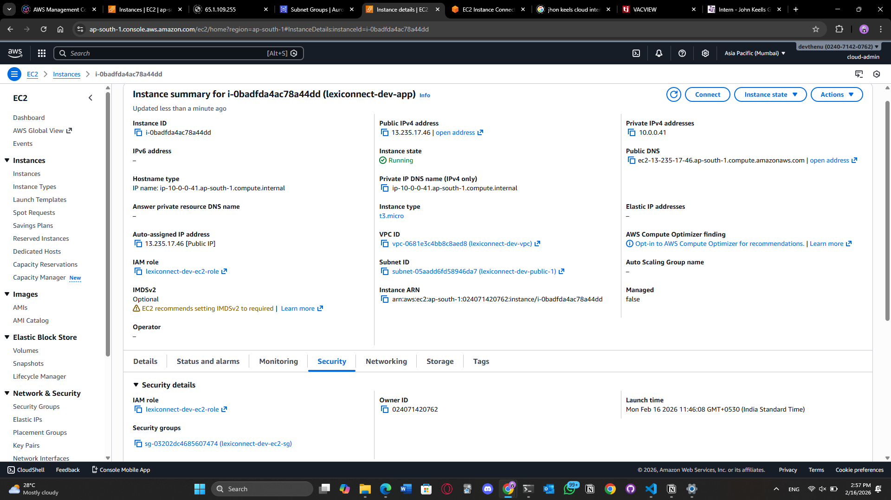
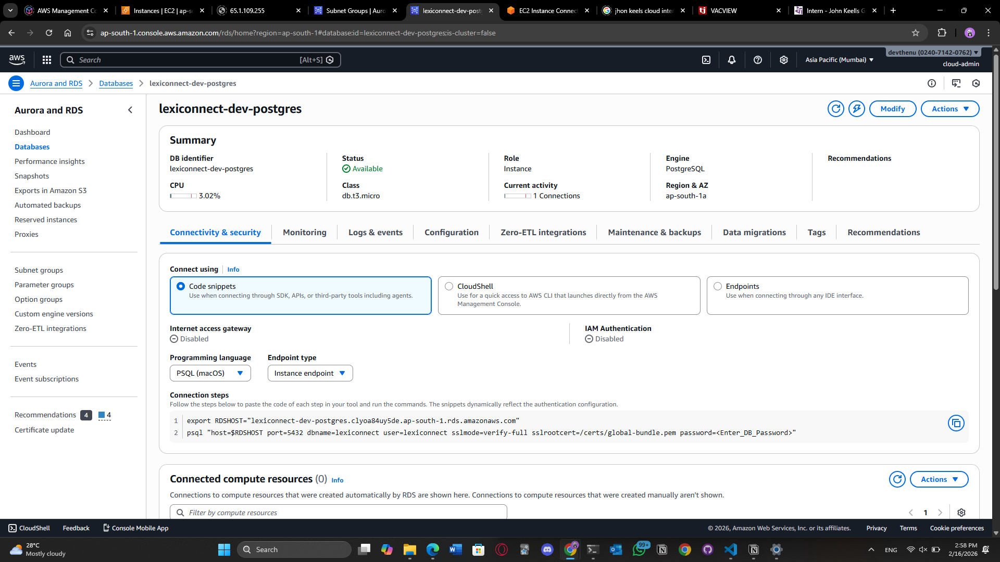

# LexiConnect Infrastructure (AWS + Terraform)

This document explains the AWS infrastructure for LexiConnect and how to deploy and destroy it using Terraform.

## Overview

LexiConnect infrastructure is deployed with Terraform and includes:

- VPC with public and private subnets (multi-AZ)
- Internet Gateway and routing
- Application Load Balancer (ALB)
- EC2 instance running Docker Compose (frontend and backend)
- RDS PostgreSQL database in private subnets
- IAM role for EC2 (SSM access and Parameter Store access)
- SSM Parameter Store for secrets (`DATABASE_URL`, environment values, etc.)

The infrastructure is designed to be repeatable:

- `terraform apply` creates everything
- `terraform destroy` removes everything cleanly

## Architecture Diagram (High-Level)

```text
Internet Users
   |
   v
[ ALB :80 ]
   |
   v
[ EC2 (Docker Compose) ]
   |
   v
[ RDS PostgreSQL (private subnet) ]
```

## AWS Resources Created

### Networking

- VPC
- 2 public subnets (ALB and EC2)
- 2 private subnets (RDS)
- Internet Gateway
- Route tables

### Security Groups

- ALB SG: inbound HTTP (`80`) from the internet
- EC2 SG: inbound HTTP (`80`) only from ALB SG
- RDS SG: inbound PostgreSQL (`5432`) only from EC2 SG

### Compute

- EC2 instance (Amazon Linux)
- Docker and Docker Compose installed automatically via user data

### Load Balancing

- Application Load Balancer (ALB)
- Target group
- Listener forwarding HTTP traffic to EC2

### Database

- RDS PostgreSQL in a private subnet group

### IAM and Access

- EC2 instance profile
- IAM role
- Attached policy: `AmazonSSMManagedInstanceCore`
- Custom policy allowing EC2 to read SSM parameters under:
  - `/lexiconnect/dev/*`

### Secrets Management

Secrets are stored in AWS Systems Manager Parameter Store.

Example paths:

- `/lexiconnect/dev/DATABASE_URL`
- `/lexiconnect/dev/FRONTEND_URL`
- `/lexiconnect/dev/ENV`
- `/lexiconnect/dev/DEBUG`

The EC2 boot script reads these and generates:

- `deploy/.env.prod`

## Terraform Folder Structure

```text
infra/
  envs/
    dev/
      main.tf
      variables.tf
      outputs.tf
      versions.tf
      userdata.sh.tftpl
```

## Terraform Remote State (Recommended)

Store Terraform state in:

- S3 bucket (with versioning enabled)
- DynamoDB table (for state locking)

This reduces state corruption risk and supports safe re-deployments.

## Deployment Workflow (Exact Commands)

### 1) Configure AWS CLI

```bash
aws configure
aws sts get-caller-identity
aws configure set region ap-south-1
```

### 2) Export Terraform Variables (Do Not Commit Secrets)

```bash
export TF_VAR_my_ip_cidr="YOUR_PUBLIC_IP/32"
export TF_VAR_key_name="YOUR_EC2_KEYPAIR_NAME"
export TF_VAR_repo_url="https://github.com/<yourname>/<repo>.git"
export TF_VAR_db_password="StrongPassword123!"
```

### 3) Terraform Init and Apply

```bash
cd infra/envs/dev
terraform init
terraform fmt -recursive
terraform validate
terraform plan
terraform apply
```

## Outputs

After `terraform apply`, Terraform should print:

- `alb_dns_name`
- `ec2_public_ip`
- `rds_endpoint`

## Testing After Apply

### ALB Health Check

```bash
curl http://<alb_dns_name>/health
```

Expected response:

```text
ok
```

### API Health Check

```bash
curl http://<alb_dns_name>/api/health
```

Expected response:

```json
{"status":"ok"}
```

## Accessing the Instance

### Recommended (SSM)

```bash
aws ssm start-session --region ap-south-1 --target <instance-id>
```

### Optional SSH (Fallback)

```bash
ssh -i lexi-key.pem ec2-user@<ec2_public_ip>
```

SSH should be restricted by security group to your IP only.

## Destroy (Cleanup)

When testing is complete, destroy all resources to avoid AWS charges:

```bash
cd infra/envs/dev
terraform destroy
```

## Proof of Repeatability (Portfolio Evidence)

This infrastructure was tested for repeatability:

- `terraform apply` creates infrastructure successfully
- Application starts automatically via Docker Compose
- ALB health checks pass
- `terraform destroy` removes resources cleanly
- Re-apply works without manual changes

## Screenshots

### Terraform




### Health Checks





### AWS Console





## Cost Notes

To stay within free tier or low-cost usage:

- No NAT Gateway is used
- RDS uses `db.t3.micro`
- Backup retention is disabled
- ALB and EC2 footprint is minimal
- Destroy resources when not in use
