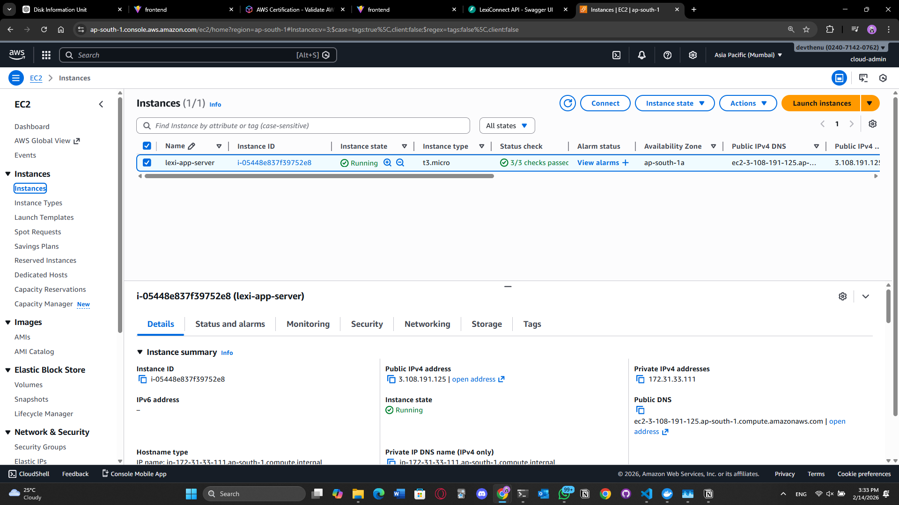
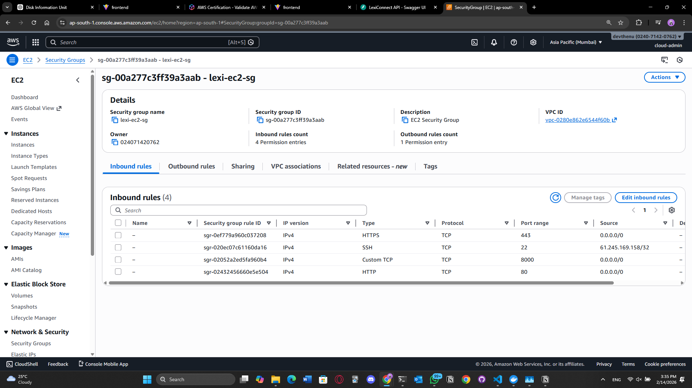
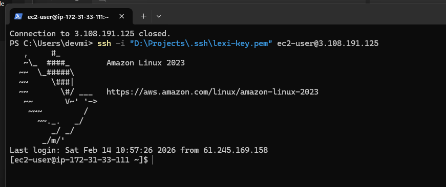
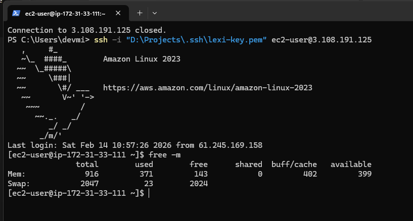
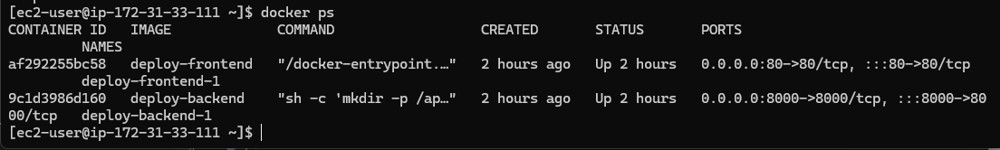
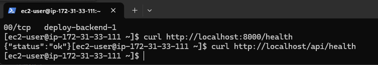
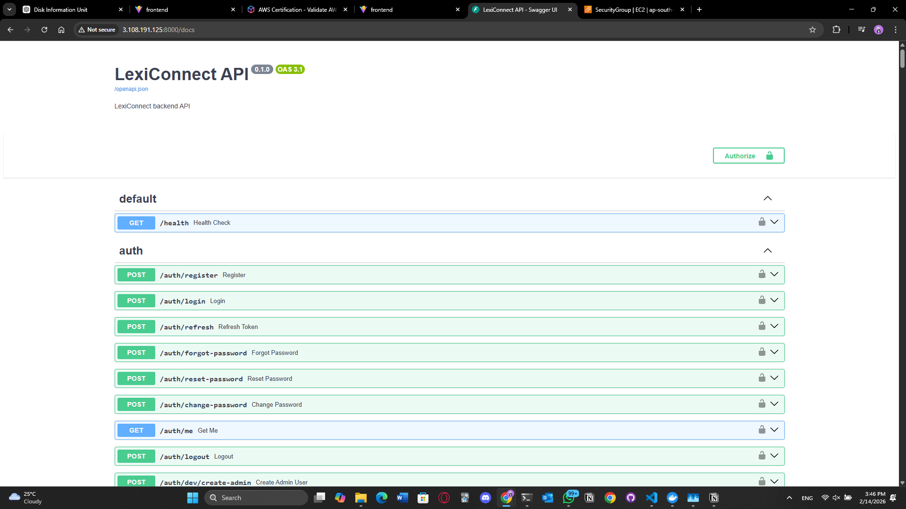
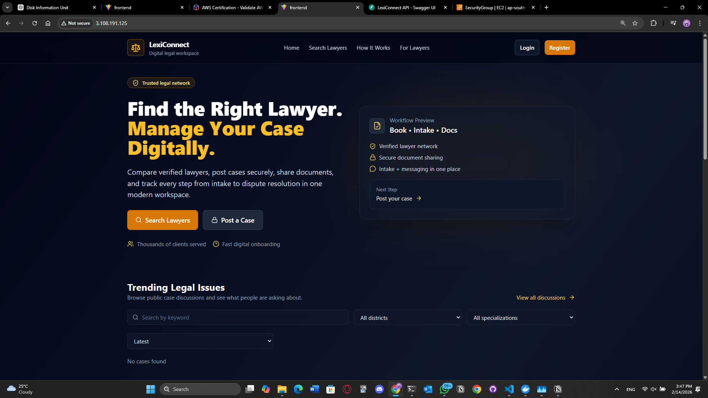

# LexiConnect - Production Deployment Runbook (EC2 + Docker Compose + Nginx + RDS)

This runbook documents how LexiConnect is deployed and operated in production on AWS EC2 using Docker Compose, with PostgreSQL hosted on Amazon RDS.

> **Goal:** If the server is lost tomorrow, a new engineer can rebuild and verify production using this document.

---

## Table of Contents

- [1. Architecture](#1-architecture)
- [2. Live Endpoints](#2-live-endpoints)
- [3. Prerequisites](#3-prerequisites)
- [4. AWS Configuration](#4-aws-configuration)
- [5. Server Bootstrap](#5-server-bootstrap)
- [6. Deploy (Docker Compose)](#6-deploy-docker-compose)
- [7. Verification Checklist](#7-verification-checklist)
- [8. Operations](#8-operations)
- [9. Troubleshooting](#9-troubleshooting)
- [10. Evidence (Screenshots)](#10-evidence-screenshots)

---

## 1. Architecture

### Components

- **Frontend:** Vite build served by **Nginx** container (port 80)
- **Backend:** FastAPI served by **Uvicorn** container (port 8000)
- **Reverse Proxy:** Nginx proxies `/api/*` and `/docs` to backend
- **Database:** Amazon RDS PostgreSQL (private)
- **Host:** Amazon EC2 (Amazon Linux 2023, `t3.micro`)
- **Swap:** 2GB swap enabled (prevents OOM during build on `t3.micro`)

### Diagram (logical)

Client Browser
- `http://<ALB_DNS>/` -> ALB -> EC2 Nginx (frontend)
- `http://<ALB_DNS>/api/*` -> ALB -> EC2 Nginx -> Backend (Uvicorn)
- Backend -> RDS PostgreSQL

---

## 2. Live Endpoints

- **Web (ALB):** `http://<ALB_DNS>/`
- **Health (ALB):** `http://<ALB_DNS>/health`
- **API Health (ALB):** `http://<ALB_DNS>/api/health`
- **Swagger (ALB):** `http://<ALB_DNS>/docs` (also works: `http://<ALB_DNS>/api/docs`)
- **Web (EC2 direct):** `http://<PUBLIC_IP>/`
- **API Health (EC2 direct):** `http://<PUBLIC_IP>/api/health`
- **Swagger (EC2 direct):** `http://<PUBLIC_IP>/docs`

---

## 3. Prerequisites

### Local Machine (Your Laptop)

- SSH client (PowerShell / OpenSSH)
- EC2 keypair file: `lexi-key.pem`

### AWS Resources

- EC2 instance (public IP)
- ALB (HTTP 80 listener, target group on EC2:80)
- RDS PostgreSQL instance
- Security Groups configured correctly:
  - EC2 SG allows inbound **22** from your IP, **80** from ALB SG (or `0.0.0.0/0` during setup)
  - RDS SG allows inbound **5432** from **EC2 SG** (not open to the internet)

---

## 4. AWS Configuration

### 4.1 EC2 Security Group (Inbound)

- [x] SSH (22) -> **My IP**
- [x] HTTP (80) -> **ALB SG** (or temporary `0.0.0.0/0`)
- [ ] Optional: Backend debug (8000) -> My IP (prefer OFF in final)

### 4.2 RDS Security Group (Inbound)

- [x] PostgreSQL (5432) -> **Source: EC2 Security Group**

> This ensures DB is private and only reachable from the app server.

---

## 5. Server Bootstrap

### 5.1 SSH into Server

```bash
ssh -i "lexi-key.pem" ec2-user@<PUBLIC_IP>
```

### 5.2 Install Docker

```bash
sudo dnf update -y
sudo dnf install docker -y
sudo systemctl enable docker
sudo systemctl start docker
sudo usermod -aG docker ec2-user
newgrp docker
```

Verify:

```bash
docker --version
```

### 5.3 Create Swap (Recommended for `t3.micro`)

Prevents build failures (OOM) when running `npm run build`.

```bash
sudo fallocate -l 2G /swapfile || sudo dd if=/dev/zero of=/swapfile bs=1M count=2048
sudo chmod 600 /swapfile
sudo mkswap /swapfile
sudo swapon /swapfile
free -m
```

Persist across reboot:

```bash
echo '/swapfile swap swap defaults 0 0' | sudo tee -a /etc/fstab
```

---

## 6. Deploy (Docker Compose)

### 6.1 Clone Repo

```bash
cd ~
git clone <YOUR_REPO_URL>
cd lexiconnect-legal-platform
```

### 6.2 Ensure Uploads Directory Exists (Host)

```bash
mkdir -p uploads
```

### 6.3 Deploy Using Production Compose

```bash
cd deploy
docker compose -f docker-compose.prod.yml down
docker compose -f docker-compose.prod.yml up -d --build
```

### 6.4 Check Status

```bash
docker compose -f docker-compose.prod.yml ps
docker compose -f docker-compose.prod.yml logs --tail=80 backend
docker compose -f docker-compose.prod.yml logs --tail=80 frontend
```

---

## 7. Verification Checklist

Run these on EC2.

### 7.1 Containers Running

```bash
docker ps
docker compose -f docker-compose.prod.yml ps
```

- [ ] Backend container is Up
- [ ] Frontend container is Up
- [ ] Ports exposed: 80 and 8000

### 7.2 Backend Local Health

```bash
curl http://localhost:8000/health
```

Expected:

```json
{"status":"ok"}
```

### 7.3 Nginx Proxy Health

```bash
curl http://localhost/api/health
```

Expected:

```json
{"status":"ok"}
```

### 7.4 Swagger via Proxy

```bash
curl -I http://localhost/docs
```

Expected:

```text
HTTP/1.1 200 OK
```

### 7.5 Public Browser Check

Open:

- [ ] `http://<ALB_DNS>/` loads frontend
- [ ] `http://<ALB_DNS>/docs` loads Swagger
- [ ] `http://<ALB_DNS>/api/health` returns OK

### 7.6 Validate System Health (First Response)

From your laptop:

```bash
curl -i http://<ALB_DNS>/health
curl -i http://<ALB_DNS>/api/health
```

Expected:

- `/health` -> HTTP 200
- `/api/health` -> HTTP 200

From EC2:

```bash
docker compose -f deploy/docker-compose.prod.yml ps
docker ps --format "table {{.Names}}\t{{.Ports}}"
docker compose -f deploy/docker-compose.prod.yml logs --tail=200
docker stats
```

### 7.7 Exposure Proof (from EC2)

```bash
docker ps --format "table {{.Names}}\t{{.Ports}}"
sudo ss -lntp | egrep ':80|:8000' || true
```

What this proves:

- EC2 host is listening on `:80`
- EC2 host is **not** listening on `0.0.0.0:8000`
- Backend container shows `8000/tcp` only (no host mapping)

---

## 8. Operations

### 8.1 View Logs

```bash
cd ~/lexiconnect-legal-platform/deploy
docker compose -f docker-compose.prod.yml logs -f
```

### 8.2 Restart

```bash
docker compose -f docker-compose.prod.yml restart
```

Restart only backend:

```bash
docker compose -f docker-compose.prod.yml restart backend
```

### 8.3 Stop Stack

```bash
docker compose -f docker-compose.prod.yml down
```

### 8.4 Update Deployment (Pull Latest + Rebuild)

```bash
cd ~/lexiconnect-legal-platform
git pull

cd deploy
docker compose -f docker-compose.prod.yml up -d --build
```

### 8.5 Deploy (Manual)

```bash
ssh -i <KEY>.pem ec2-user@<EC2_IP>

cd ~/lexiconnect-legal-platform
git pull

cd deploy
docker compose -f docker-compose.prod.yml down --remove-orphans
docker compose -f docker-compose.prod.yml up -d --build

docker compose -f docker-compose.prod.yml ps
```

### 8.6 Rollback (simple)

```bash
cd ~/lexiconnect-legal-platform
git log --oneline -n 10
git checkout <KNOWN_GOOD_COMMIT>
cd deploy
docker compose -f docker-compose.prod.yml up -d --build
```

### 8.7 Log Baseline Commands

```bash
docker compose -f deploy/docker-compose.prod.yml ps
docker compose -f deploy/docker-compose.prod.yml logs --tail=200 -f
docker stats
```

---

## 9. Troubleshooting

### Problem: Build hangs at `rendering chunks...`

Cause: Low memory on `t3.micro` during `npm run build`.

Fix:

- [ ] Ensure swap is enabled (`free -m`)
- [ ] Rebuild after swap is enabled

```bash
free -m
sudo swapon --show
```

### Problem: `/docs` works but API calls from frontend fail

Check:

- [ ] Nginx routes `/api/` correctly to backend
- [ ] Frontend uses `/api` (recommended) OR correct base URL

Quick test:

```bash
curl http://localhost/api/health
```

### Incident: API returns 502 / not responding

Symptoms:

- Frontend works but `/api/*` fails
- ALB may still show healthy if `/health` is served by frontend Nginx

Checks:

```bash
docker compose -f deploy/docker-compose.prod.yml ps
docker compose -f deploy/docker-compose.prod.yml logs backend --tail=200
docker compose -f deploy/docker-compose.prod.yml logs frontend --tail=200
```

Fix:

```bash
docker compose -f deploy/docker-compose.prod.yml restart backend
```

### Problem: Backend cannot connect to DB

Check:

- [ ] RDS SG allows inbound 5432 from EC2 SG
- [ ] `DATABASE_URL` is correct
- [ ] Backend logs show successful DB connection

```bash
docker compose -f docker-compose.prod.yml logs --tail=200 backend
```

### Incident: DB connection errors

Symptoms:

- Backend logs show connection refused / timeout

Checks:

- Verify RDS SG allows 5432 from EC2 SG
- From EC2:

```bash
nc -vz <RDS_ENDPOINT> 5432
```

Fix:

- Correct security groups or DB endpoint env var

---

## 10. Evidence (Screenshots)

### 10.1 Real Output Evidence

#### curl results

```text
PS C:\Users\devmi> curl.exe -i http://lexi-alb-547422898.ap-south-1.elb.amazonaws.com/health
HTTP/1.1 200 OK
Date: Sun, 15 Feb 2026 08:08:43 GMT
Content-Type: text/plain
Content-Length: 3
Connection: keep-alive
Server: nginx/1.29.5

ok
PS C:\Users\devmi> curl.exe -i http://lexi-alb-547422898.ap-south-1.elb.amazonaws.com/api/health
HTTP/1.1 200 OK
Date: Sun, 15 Feb 2026 08:08:43 GMT
Content-Type: application/json
Content-Length: 15
Connection: keep-alive
Server: nginx/1.29.5

{"status":"ok"}
PS C:\Users\devmi>
```

#### Exposure proof output

```text
PS C:\Users\devmi> ssh -i "D:\Projects\.ssh\lexi-key.pem" ec2-user@65.1.109.255
   ,     #_
   ~\_  ####_        Amazon Linux 2023
  ~~  \_#####\
  ~~     \###|
  ~~       \#/ ___   https://aws.amazon.com/linux/amazon-linux-2023
   ~~       V~' '->
    ~~~         /
      ~~._.   _/
         _/ _/
       _/m/'
Last login: Sun Feb 15 08:08:13 2026 from 212.104.231.82
[ec2-user@ip-10-0-0-158 ~]$ docker ps --format "table {{.Names}}\t{{.Ports}}"
NAMES                    PORTS
lexiconnect-frontend-1   0.0.0.0:80->80/tcp, :::80->80/tcp
lexiconnect-backend-1    8000/tcp
[ec2-user@ip-10-0-0-158 ~]$ sudo ss -lntp | egrep ':80|:8000' || true
LISTEN 0      4096         0.0.0.0:80         0.0.0.0:*    users:(("docker-proxy",pid=14818,fd=4))
LISTEN 0      4096            [::]:80            [::]:*    users:(("docker-proxy",pid=14826,fd=4))
[ec2-user@ip-10-0-0-158 ~]$
```

### 10.2 ALB Screenshots

- [`docs/screenshots/alb-targets-healthy.png`](screenshots/alb-targets-healthy.png)
- [`docs/screenshots/alb-listener-80.png`](screenshots/alb-listener-80.png)
- [`docs/screenshots/alb-dns.png`](screenshots/alb-dns.png)

### 10.3 Deployment Screenshots

| File | Caption | Preview |
|---|---|---|
| [`01-ec2-instance-overview.png`](screenshots/01-ec2-instance-overview.png) | EC2 instance running (public IP, status checks) |  |
| [`02-ec2-security-group-inbound.png`](screenshots/02-ec2-security-group-inbound.png) | EC2 SG inbound rules (22 + 80) |  |
| [`03-rds-endpoint-and-security.png`](screenshots/03-rds-endpoint-and-security.png) | RDS endpoint + SG inbound from EC2 SG |  |
| [`04-ssh-login.png`](screenshots/04-ssh-login.png) | Successful SSH login |  |
| [`05-swap-enabled-free-m.png`](screenshots/05-swap-enabled-free-m.png) | Swap enabled output (`free -m`) |  |
| [`06-docker-compose-ps.png`](screenshots/06-docker-compose-ps.png) | Containers running (`docker compose ps`) |  |
| [`07-health-checks.png`](screenshots/07-health-checks.png) | Health checks via `curl` |  |
| [`08-swagger-via-nginx.png`](screenshots/08-swagger-via-nginx.png) | Swagger accessible via Nginx |  |
| [`09-frontend-homepage.png`](screenshots/09-frontend-homepage.png) | Frontend homepage working via public IP |  |
